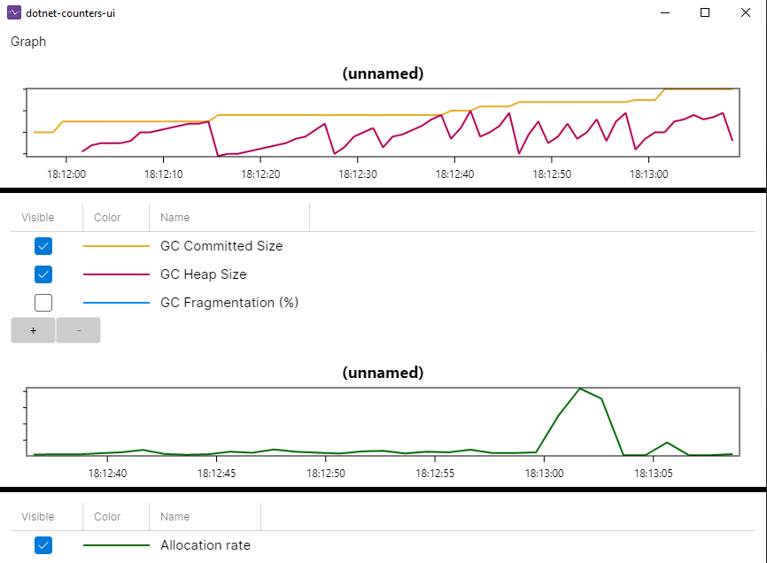
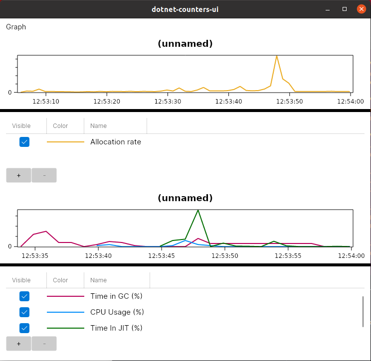

# dotnet-counters-ui

Cross-platform UI tool for observing .NET counters, like it was possible on Windows with *Performance Counters* and *Performance Monitor* in .NET Framework times. Windows, Linux and macOS supported thanks to [Avalonia](https://avaloniaui.net/).

| Windows | Linux |
| ------ | ------ | 
|  |  |
